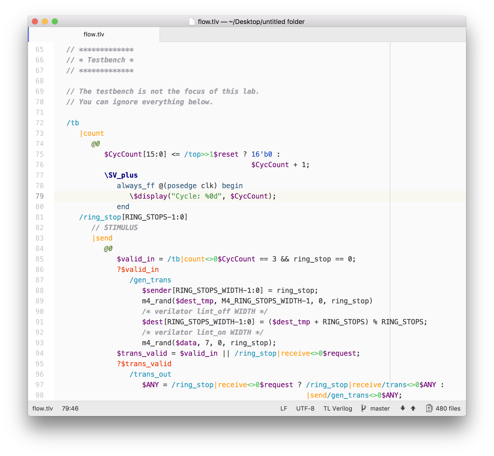

# TL-Verilog support for Atom



## How to use

* Install `tl-verilog` package (eq. search "tlv" in settings)
* Set color theme to `One Light`
* Set syntax theme to `One Light`
* Open .tlv file
* Enjoy

## Features

### Done

- Syntax highlighting for `.tlv` `.TLV` files

### Known bugs

- None so far
- Open the issue in one of the repos

## Git repos

- Personal, main: [dbogatov/TL-Verilog-Atom](https://git.dbogatov.org/dbogatov/TL-Verilog-Atom)
- GitHub, mirror: [dbogatov/tlv-atom](https://github.com/dbogatov/tlv-atom)

## Repository organization

This repository is organized as follows:

```
grammars/                     syntax definition
styles/                       theme definitions
static/                       static assets for README
package.json                  package configuration
LICENSE.txt                   license
README.md                     readme
```

## Contributing
1. Fork it ( [dbogatov/tlv-atom](https://github.com/dbogatov/tlv-atom) )
2. Create your feature branch (`git checkout -b my-new-feature`)
3. Commit your changes (`git commit -am 'Add some feature'`)
4. Push to the branch (`git push origin my-new-feature`)
5. Create a new Pull Request

## See also

[TL-Verilog](https://atom.io/packages/tl-verilog)

## License

[MIT](LICENSE)
